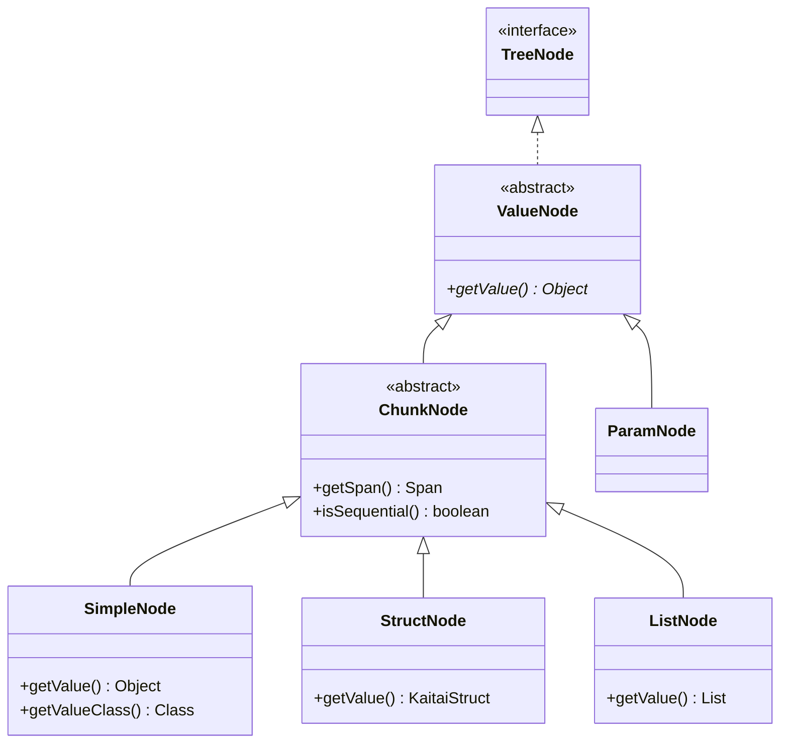

[](https://jitpack.io/#Mingun/kaitai_struct_model)
[](https://opensource.org/licenses/MIT)

# kaitai_struct_model
A simple Swing `TreeModel` and `TreeNode` implementations for exploring classes, generated by
[KaitaiStruct](https://kaitai.io) java generator in debug mode.

How customized [Viewer](https://github.com/kaitai-io/kaitai_struct_gui) could look
(in [FlatLaf](https://github.com/JFormDesigner/FlatLaf) Dark theme):


<details>
<summary>Example file</summary>
  
```yaml
meta:
  id: offsets
seq:
  - id: padding
    type: u1
  - id: unsized
    type: type
  - id: sized
    type: type
    size: 10
instances:
  parse:
    pos: 5
    size: 5
  value_scalar:
    value: 42
  value_list:
    value: '["42"]'
types:
  type:
    seq:
      - id: padding
        type: u1
      - id: unsized_simple
        type: u1
      - id: sized_simple
        size: 1
      - id: unsized_array
        type: elem
        repeat: expr
        repeat-expr: 2
      - id: sized_array
        type: elem
        size: 3
        repeat: expr
        repeat-expr: 1
  elem:
    seq:
      - id: padding
        type: u1
      - id: value
        type: u1
```
</details>

## Class diagram of nodes

`ParamNode` is unused because it is impossible to distinguish between
parameters and instances without [kaitai_struct_compiler#191].



[kaitai_struct_compiler#191]: https://github.com/kaitai-io/kaitai_struct_compiler/pull/191
