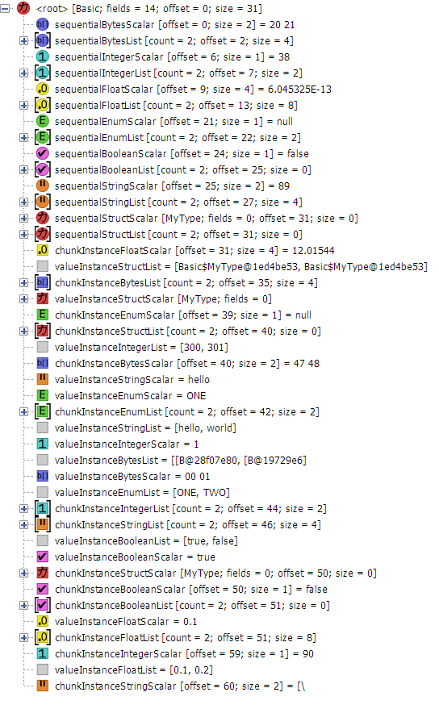

# kaitai_struct_model
A Swing `TreeModel` and `TreeNode` implementations for exploring classes, generated by
[KaitaiStruct](https://kaitai.io) java generator in debug mode.

Screenshot showing most possible types of nodes:

## Class diagram of nodes

`ParamNode` is unused because it is impossible to distinguish between
parameters and instances without [kaitai_struct_compiler#191].

[kaitai_struct_compiler#191]: https://github.com/kaitai-io/kaitai_struct_compiler/pull/191
